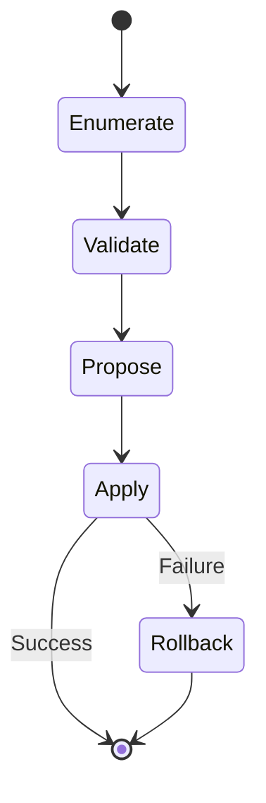
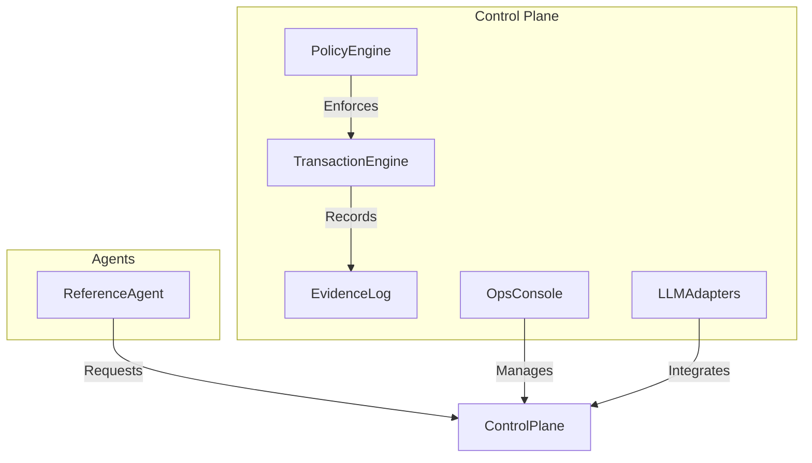

# Transactional AI (Core)

**A reliability protocol for AI Agents.**

This library prevents AI agents from leaving systems in broken or "zombie" states. It enforces a strict **Saga Pattern**, ensuring that multi-step agent actions either complete fully or roll back cleanly using defined compensating actions.

## The Problem
LLMs are non-deterministic. When an agent creates a file, updates a database, and then fails to send an email, your system is left in an inconsistent state.

## The Solution
`transactional-ai` provides a lightweight state machine that forces you to define an `undo` operation for every `do` operation.

## Usage (The Litmus Test)

```typescript
import { Transaction } from '@transactional-ai/core';

const agent = new Transaction();

await agent.run(async (tx) => {
    // Step 1: Create Resource
    const fileId = await tx.step('create-file', {
        do: () => googleDrive.createFile('report.txt'),
        undo: (result) => googleDrive.deleteFile(result.id) 
    });

    // Step 2: External Action
    await tx.step('email-report', {
        do: () => emailService.send(fileId),
        undo: () => emailService.recall(fileId) 
    });
});
```

## Features
- Atomic Steps: Every step is tracked.
- Auto-Rollback: If Step 3 fails, Step 2 and Step 1 are automatically reversed.
- Resumability: (Coming Soon) Persist state to Redis to resume crashed agents.
  4. Apply changes transactionally
  5. Rollback on failure
- **Validation:** All changes must pass policy checks before commit
- **Rollback:** If any step fails, revert all changes using compensating actions
- **Diagram:**



---

## 6. Acceptance Criteria

- Atomic execution: all-or-nothing
- Hard policy enforcement: no bypass
- Immediate halt/kill switch
- Deterministic replay from evidence
- Identity isolation for all agent actions
- Validation and rollback for every workflow

---

## 7. Strategic Non-Goals

- Not a general-purpose workflow engine
- Not a replacement for cloud-native policy engines (e.g., OPA)
- Does not allow agents to self-modify policies or runtime
- No support for non-transactional, best-effort, or probabilistic actions

---

## 8. Technical Architecture & Implementation Plan

### Architecture Diagram



### Components
- **Execution Substrate:** State machine with explicit rollback handlers
- **Policy Engine:** OPA/Rego or custom DSL for policy checks
- **LLM Provider Integration:** Adapter pattern for OpenAI, Anthropic, Gemini
- **Logging/Replay:** Event sourcing, signed evidence, replay CLI
- **Kill Switch:** Immediate halt via Ops Console/API
- **Ops Console:** Web/CLI for monitoring, incident response, and policy management
- **Reference Agent:** IAM Policy Auditor as MVP

### Implementation Plan (MVP/MVA)
1. State machine execution engine with rollback
2. Policy engine integration
3. Evidence log and replay CLI
4. LLM provider adapters
5. Ops Console (CLI, then web)
6. Reference agent (IAM Policy Auditor)
7. Stress test suite
8. Enterprise features (see below)

---

## 9. Open Source & Monetization Strategy

| Feature                | OSS Core | Enterprise/SaaS |
|------------------------|----------|-----------------|
| Transactional Engine   | Yes      | Yes             |
| Policy Engine          | Yes      | Yes             |
| Multi-LLM Integration  | Yes      | Yes             |
| Ops Console (CLI)      | Yes      | Yes             |
| Ops Console (Web)      | No       | Yes             |
| Advanced Audit/Replay  | No       | Yes             |
| SSO/Identity Vault     | No       | Yes             |
| Incident Response API  | No       | Yes             |
| Enterprise Support     | No       | Yes             |

**Adoption Plan:**
- Launch OSS core on GitHub with reference agent and CLI console
- Provide SaaS/enterprise add-ons (web console, SSO, advanced audit, support)
- Target SRE, compliance, and platform engineering communities

---

## 10. Next Steps / Roadmap

1. State machine execution engine
2. Policy engine integration
3. Evidence log and replay CLI
4. LLM provider adapters
5. Ops Console (CLI, then web)
6. Reference agent (IAM Policy Auditor)
7. Stress test suite
8. Enterprise features rollout

---

## 11. Deliverables

- Architecture diagrams (see above)
- State machine and workflow diagrams
- Reference agent workflow (IAM Policy Auditor)
- Capabilities table (see above)
- OSS vs Enterprise feature table
- Step-by-step implementation plan
- Stress test suite and expected results
- MVP/MVA definition

---

**End of Blueprint**
