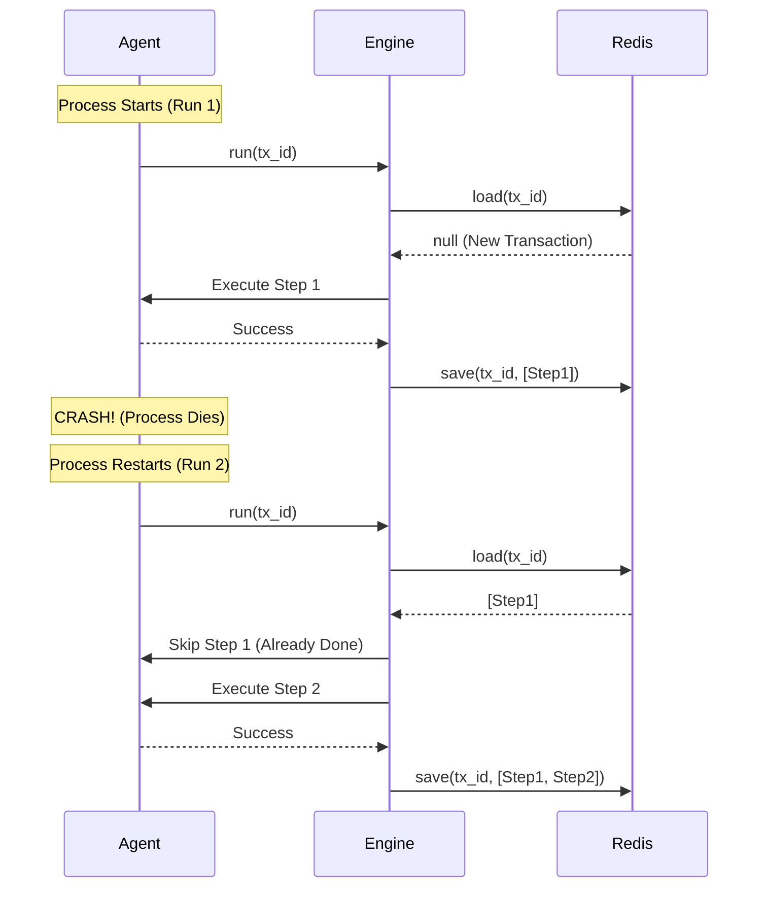

# Architecture

## Core Concept: The Persistent Saga
The system is built around a lightweight `Transaction` class that maintains a persistent stack of executed steps. Unlike simple `try/catch` blocks, this state is serialized to external storage (Redis/File) after every step.

## Components

### 1. Transaction Engine (`Transaction.ts`)
* **Responsibility:** Orchestrates the workflow.
* **Logic:**
    * **On Start:** Loads previous state from Storage.
    * **On Step:** Checks if `step.name` exists in history.
        * If **Yes**: Skips execution, re-hydrates `compensate` stack.
        * If **No**: Executes `execute()`, pushes to stack, saves to Storage.
    * **On Error:** Iterates stack in reverse, executing `compensate()`.

### 2. Storage Adapters (`Storage.ts`)
* **Interface:** `save`, `load`, `clear`.
* **Implementations:**
    * `FileStorage`: JSON files (Dev/Testing).
    * `RedisStorage`: Key-value store with TTL (Production).
* **Data Structure:**
    ```json
    [
      { "name": "step-1", "result": "xyz", "status": "completed" },
      { "name": "step-2", "result": null,  "status": "pending" }
    ]
    ```

### 3. CLI Inspector (`bin/inspect.ts`)
* **Command:** `tai-inspect`
* **Function:** A standalone CLI tool that bypasses the engine to connect directly to the configured storage and render an ASCII tree of the transaction status.

## Resumability Flow



### Next Step
Once you update this file and commit it (`git add architecture.md`), you are ready for the big moment:

```bash
npm publish